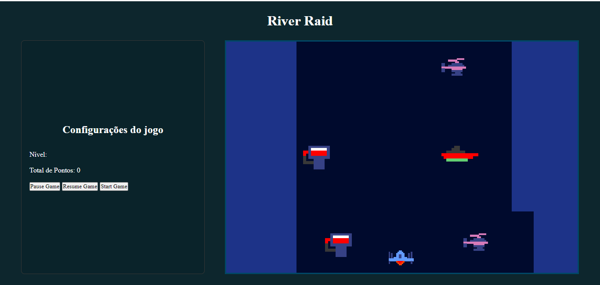

  O projeto consiste na implementação de uma releitura do tradicional jogo de Atari chamadoRiver Raid.
 O jogo foi implementado utilizando apenas JavaScript, CSS e HTML.
 River Raid:
–Jogo de rolagem;
–Avião avança ao longo do curso de um rio;
–Destruindo inimigos;
–Mantendo o tanque com combustível.
## Tecnologias

Aqui estão as tecnologias utilizadas neste projeto.

* HTML5 version  5.0.0
* CSS3 version 3.0.0
* Javascript version 1.5.0
* Canvas
## Serviços usados

* Github

## Começando...

* Dependência
  - 

## Como usar

### 1 - Ao acessar, você verá a página inicial <3

### 2 - Contato:

## Features

As principais  Features do projeto são:
 -
 - 

## Links
  - Repository: https://github.com/ElineFarias/Projeto02TecWeb.git

  ## Versão

  1.0.0.0

  ## Autora

  * **Maria Eline Silva de Farias** 

Obrigado por me visitar e boa codificação!
